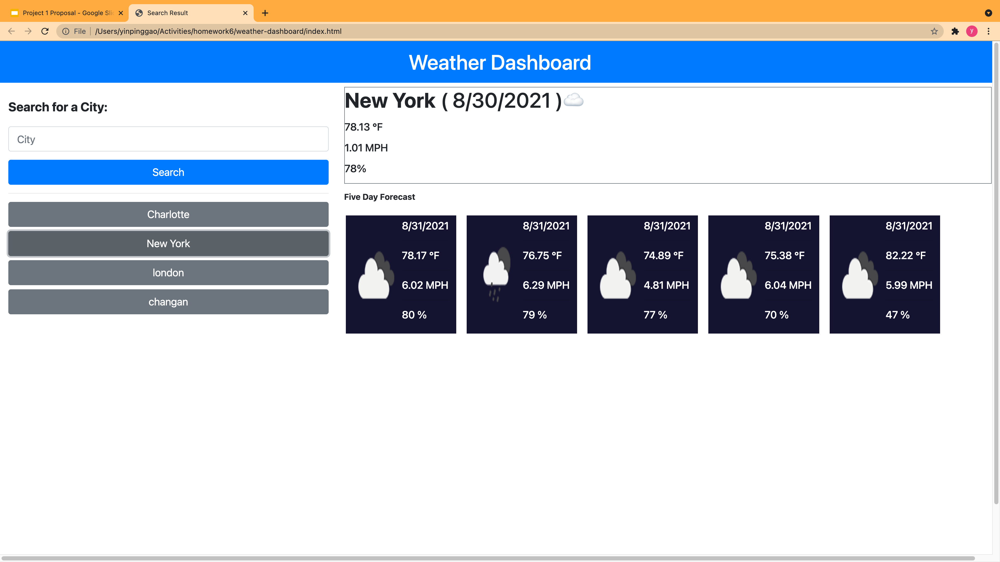

# weather-dashboard

## User Story

```
AS A traveler
I WANT to see the weather outlook for multiple cities
SO THAT I can plan a trip accordingly
```

## Features
This application has the following features:

** WHEN user search for a city in the form input, this application presents the current and future conditions for that city and that city is added to the search history
** WHEN user view current weather conditions for that city, this application presents the city name, the date, an icon representation of weather conditions, the temperature, the humidity, the wind speed, and the UV index
** WHEN user view the UV index, this application presents with a color that indicates whether the conditions are favorable, moderate, or severe
** WHEN user view future weather conditions for that city, this application presents a 5-day forecast that displays the date, an icon representation of weather conditions, the temperature, the wind speed, and the humidity
** WHEN user click on a city in the search history, this application again presents current and future conditions for that city

## Outcome


## Links
[deploy link](https://yinping-520.github.io/weather-dashboard/)

[github](https://github.com/yinping-520/weather-dashboard)

